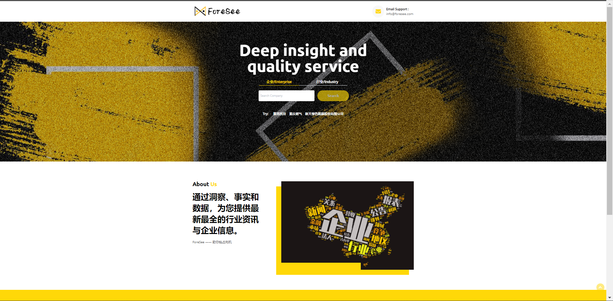

# ForeSee-Front Group
> Group Members: Feng Yanxia, Chen Jinying, Li Yi, Gong Zhilin, Peng Jiahui

本文档介绍了前端小组开发的网页页面及相关业务逻辑。网页采用[Vue.js](https://cn.vuejs.org)框架开发。

## 0. OUTLINE
1. [技术栈](#techstack)
2. [项目架构](#structure)
3. [模块介绍](#module)
4. [数据接口](#interface)

<br>

## <span id = "techstack">1. 技术栈

- [Vue.js](https://cn.vuejs.org)
- [vue-cli-3](https://cli.vuejs.org/zh/)
- [vue-router](https://router.vuejs.org/zh/)
- [webpack](https://www.webpackjs.com/)
- [aixos](https://github.com/axios/axios)
- [Element-UI](http://element-cn.eleme.io/#/zh-CN)
- [echarts](https://echarts.apache.org/zh/index.html)

<br>

## <span id = "structure">2. 项目结构

```
│  App.vue                                       //主组件
│  main.js
│  
├─assets                                         //静态资源
│  │  logo.png                                   //浏览器标签图表
│  │  
│  ├─images
│  │      banner-bg.png
│  │      cta-bg.png
│  │      index-wordcloud.png
│  │      logo-black.png
│  │      logo-white.png
│  │      
│  └─js
│          LineChart.js                          //企业营收折线图
│          
├─components                                     //组件
│      Banner.vue                                //横幅
│      Card.vue                                  //企业详情表格
│      Content.vue                               //企业网格
│      CTA.vue                                   //联系我们(广告标语)
│      Footer.vue                                //尾部
│      Geo.vue                                   //行业地图
│      GeoSingle.vue                             //企业地图
│      Header.vue                                //头部
│      Industrial.vue                            //行业检索结果
│      LineChart.vue                             //企业营收折线图
│      News.vue                                  //新闻公告
│      Search.vue                                //搜索框
│      SearchBox1.vue                            //搜索框-企业检索
│      SearchBox2.vue                            //搜索框-行业检索
│      Tabs.vue                                  //标签-行业检索页
│      Tabs2.vue                                 //备用
│      
├─mixins
│      index.js
│      
├─router                                         //路由配置
│      index.js
│      
└─views                                          //主要页面
        Detail.vue                               //企业详情页
        Index.vue                                //首页
        Industry.vue                             //行业检索页
        MoreNews.vue                             //新闻详情页
        Retrieval.vue                            //企业检索页

```

<br>

## <span id = "module">3. 模块介绍</span>

<br>

### 3.1 公共组件

- 3.1.1 [回到顶部组件(BackTop.vue)](#backtop)

- 3.1.2 [头部组件(Header.vue)](#header)

- 3.1.3 [横幅组件(Banner.vue)](#banner)

- 3.1.4 [召唤组件(CTA.vue)](#cta)

- 3.1.5 [尾部组件(Footer.vue)](#footer)

<br>

#### <span id="backtop">3.1.1 BackTop.vue</span>

<p align = "center">


该组件提供了鼠标单击后页面滑动回到顶部的功能，在网页右下角显示。
</p>

<br>

#### <span id="header">3.1.2 头部组件(Header.vue)</span>

<p align = "center">

</p>

- 功能定位
     置于页面顶部，展示网站logo和部分栏目信息，并提供首页的跳转入口。

- 设计解读
     - 网站logo：位于最左边，展示logo的同时提供了单击回到首页的方式。
     - 互联网行业分析报告入口：行业分析报告仅包括互联网行业，暂时在头部区域放置临时入口。
     - HOME首页跳转：随时回到首页。
     - 提供网站维护联系方式。

<br>

#### <span id="banner">3.1.3 横幅组件(Banner.vue)</span>
<p align = "center">

</p>

- 功能定位
     展示当前页面内容简要描述，主题栏目。

- 设计解读
     由背景图、页面标题以及检索内容描述构成。

- 输入输出
     - 获取首页搜索框中的输入值，以展示用户的检索词(企业检索页面)
     - 从后端获取到的相应公司的股票代码(企业详情页面)

<br>

#### <span id="cta">3.1.4 召唤组件(CTA.vue)</span>
<p align = "center">

宣传栏，强调团队服务价值。
</p>

<br>

#### <span id="footer">3.1.5 尾部组件(Footer.vue)</span>
<p align = "center">

展示logo、slogan、邮箱联系方式和版权声明。
</p>

<br>

### 3.2 首页 Index.vue
<p align = "center">

</p>

- **包含组件**
[BackTop.vue](#backtop), Search, [Footer.vue](#footer)

- **功能定位**
首页，展示项目logo、标语、简介、联系方式；提供检索入口。

- **设计解读**
1. 页面的主要部分为搜索框，封装在search.vue中
2. search.vue包含项目标语、搜索提示词及两个搜索框组件：SearchBox1.vue(企业搜索框组件), SearchBox2.vue(行业搜索框组件)
3. 两个搜索框组件中包含搜索框，实现实时检索下拉推荐菜单，与方法transFromRealtime(item)绑定；搜索按钮，实现输入框为空时禁用搜索；

- **数据接口**
     - 通过url接口【“http://222.200.184.74:8288/ForeSee/retrieval/” + this.input】、【“http://222.200.184.74:8288/ForeSee/industry/” + this.input】
     - 获取输入内容的企业/行业搜索结果​通过url接口【“http://222.200.184.74:8288/ForeSee/retrieval/” +item】获取输入内容的下拉推荐菜单

<br>

## 3.3 企业检索结果页面 Retrieval.vue
<p align = "center">

</p>

- 包含组件

[BackTop.vue](#backtop), [Header.vue](#header), [Banner](#banner), Content, [CTA.vue](#cta), [Footer.vue](#footer)

-  功能定位
企业检索页，将检索的结果企业以表格的方式展示出来

- 设计解读
1. 页面的主要部分为检索结果列表，封装在Content.vue中
2. 检索匹配的结果企业以每行三个的方式展示出来，每个图形模块包含了企业的logo、名称以及详细地址。
3. 鼠标移动至任一企业图形模块上时，会出现放大、增加阴影的动画效果。单击该模块即可跳转至该企业的详情页。

- 输入输出
通过url接口 http://222.200.184.74:8288/ForeSee/companyInfo/ 获取企业信息

<br>

## 3.4 行业报告页面 IndustryReport.vue
<p align = "center">

</p>

- 包含组件

[BackTop.vue](#backtop), [Header.vue](#header), [Banner](#banner), IndustryReportComponent, [CTA.vue](#cta), [Footer.vue](#footer)

- 功能定位

互联网行业分析报告的列表展示页面

- 设计解读

1. 页面包括常用的公共组件以及中间互联网行业分析报告列表部分。
2. 报告列表被封装在组件IndustryReportComponent.vue中，主要使用了Element-UI中带筛选功能的表格组件来实现，主要展示了行业报告的发表时间、报告标题和报告所分析的年份。
3. 发表时间可选择进行升序或者降序排列，而分析年份可根据所需要查看的年份进行结果的筛选。鼠标移动至标题可实现颜色的变换，单击报告标题可跳转至相应报告的外部网页。

- 输入输出

通过url接口 http://222.200.184.74:8288/ForeSee/industryReports/industryCode/1 获取行业报告信息


## 3.5 新闻展示页面 MoreNews.vue

- 包含组件

[BackTop.vue](#backtop), [Header.vue](#header), [Banner](#banner), MoreNewsComponent, 
MoreNewsComponent, [CTA.vue](#cta), [Footer.vue](#footer)

- 功能定位

展示详细的新闻列表

- 设计解读

1. 页面的主要部分为新闻列表，封装在MoreNewsComponent.vue中
2. 组件中设置以日期与标题为表头的列表，一页显示20条结果，分页封装在分页组件PaginationForNews.vue 中
3. 分页组件中通过方法currentChange(val) 实现点击数字进行页面切换；prevpage(val) 实现跳转到前一页；nextpage(val) 实现跳转到后一页

- 输入输出

通过url接口 http://222.200.184.74:8288/ForeSee/allNews/" + this.stockCode +"/" +page 获取当前页面的新闻信息

## 3.6 公告展示页面 MoreNotice.vue

- 包含组件

[BackTop.vue](#backtop), [Header.vue](#header), [Banner](#banner), MoreNoticeComponent, PaginationForNotice, [CTA.vue](#cta), [Footer.vue](#footer)

- 功能定位

展示详细的公告列表

- 设计解读

1. 页面的主要部分为公告列表，封装在MoreNoticeComponent.vue中
2. 组件中设置以日期与标题为表头的列表，一页显示20条结果，分页封装在分页组件PaginationForNotice.vue 中
3. 分页组件中通过方法currentChange(val) 实现点击数字进行页面切换；prevpage(val) 实现跳转到前一页；nextpage(val) 实现跳转到后一页

- 输入输出

通过url接口 http://222.200.184.74:8288/ForeSee/allNotice/" + this.stockCode +"/" +page 获取当前页面的公告信息

## 3.7 行业信息展示页面 Industry.vue
<p align = "center">

</p>

- 包含组件  

[BackTop.vue](#backtop), [Header.vue](#header), [Banner](#banner), Tabs, [CTA.vue](#cta), [Footer.vue](#footer) 

- 功能定位

行业检索后的详情页，展示了某行业的相关企业及其可视化

- 设计解读： 

Tabs.vue   

分为两个tabs：

1. 该行业的相关企业 Content

2. 该行业相关企业的可视化信息，目前有相关企业的地理坐标图，之后可能会加入企业竞争关系图、上下游关系图 Geo(目前)

- 输入输出

通过url接口 `http://222.200.184.74:8288/ForeSee/industryInfo/" + this.industryCode` 获取行业的相关信息

<br>

## 3.8 企业信息详情页面 Detail.vue
<p align = "center">

</p>

- 组件
[BackTop.vue](#backtop), [Header.vue](#header), Card, LineChart, [CTA.vue](#cta), [Footer.vue](#footer), News, GeoSingle, NewsList 

- 功能定位

企业详情展示页面  

- 设计解读

Card.vue  

公司的基本信息：公司名称、法定代表人、成立日期、注册资本、工商注册号、登记机关、股票代码

LineChart.vue  

公司营收情况折线图：营业收入、营业成本、营业利润、利润总额和净利润随时间变化的折线图

News.vue  

该公司的新闻和公告(显示标题，并设置url)

NewsList.vue  

该公司的新闻

GeoSingle.vue 

该公司地理位置的地图显示

- 输入输出

通过url接口 `http://222.200.184.74:8288/ForeSee/allInfo/" + this.stockCode` 获取企业的相关信息

## <span id = "interface">4. 数据接口</span>

| 序号 | URL 示例                                             | 参数                                         | 返回值             | 调用的网页或组件                 |
| ---- | ---------------------------------------------------- | -------------------------------------------- | ------------------ | -------------------------------- |
| 1    | http://121.46.19.26:8288/ForeSee/companyInfo/600485  | 股票代码；企业名称；<br />行业代码；行业名称 | 企业列表           | Retrieval.vue;<br />Industry.vue |
| 2    | http://121.46.19.26:8288/ForeSee/allInfo/300433      | 股票代码；企业名称                           | 某个企业的全部信息 | Detail.vue                       |
| 3    | http://121.46.19.26:8288/ForeSee/industryInfo/BK0427 | 行业代码                                     | 企业地理信息       | Geo.vue                          |
| 4    | http://121.46.19.26:8288/ForeSee/allNews/300433/2    | 股票代码；页数                               | 企业新闻           | MoreNews.vue                     |
| 5    | http://121.46.19.26:8288/ForeSee/allNotice/600496/2  | 股票代码；页数                               | 企业公告           | MoreNotice.vue                   |
