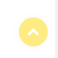
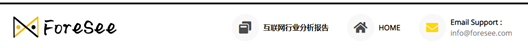
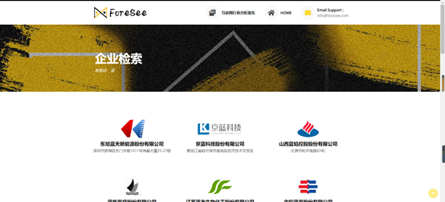
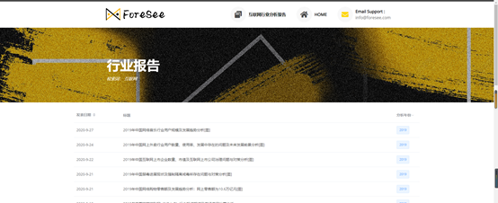
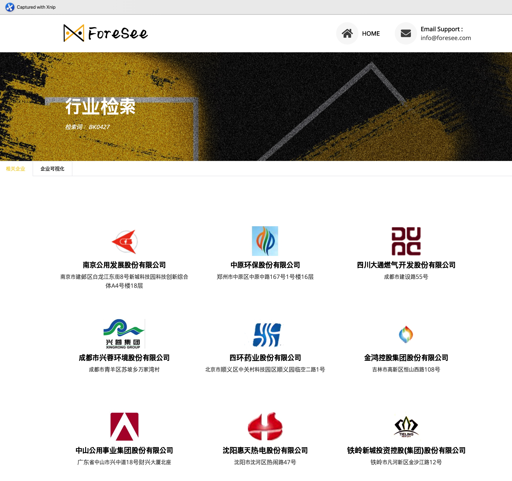
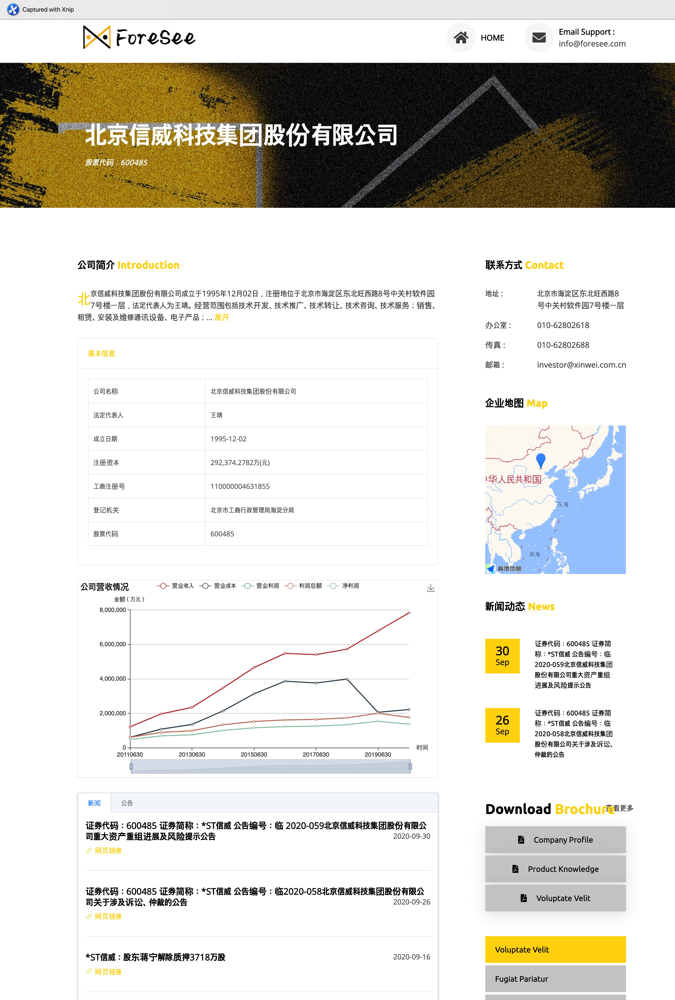

# 项目开发日志

前端组项目开发日志。


## 一、技术栈


- [Vue.js](https://cn.vuejs.org)
- [vue-cli-3](https://cli.vuejs.org/zh/)
- [vue-router](https://router.vuejs.org/zh/)
- [webpack](https://www.webpackjs.com/)
- [aixos](https://github.com/axios/axios)
- [Element-UI](http://element-cn.eleme.io/#/zh-CN)
- [echarts](https://echarts.apache.org/zh/index.html)


## 二、项目结构

以下为 /src 目录下文件结构

```

│  App.vue                                       //主组件
│  main.js
│  
├─assets                                         //静态资源
│  │  logo.png                                   //浏览器标签图表
│  │  
│  ├─images
│  │      banner-bg.png
│  │      cta-bg.png
│  │      index-wordcloud.png
│  │      logo-black.png
│  │      logo-white.png
│  │      
│  └─js
│          LineChart.js                          //企业营收折线图
│          
├─components                                     //组件
│      Banner.vue                                //横幅
│      Card.vue                                  //企业详情表格
│      Content.vue                               //企业网格
│      CTA.vue                                   //联系我们（广告标语）
│      Footer.vue                                //尾部
│      Geo.vue                                   //行业地图
│      GeoSingle.vue                             //企业地图
│      Header.vue                                //头部
│      Industrial.vue                            //行业检索结果
│      LineChart.vue                             //企业营收折线图
│      News.vue                                  //新闻公告
│      Search.vue                                //搜索框
│      SearchBox1.vue                            //搜索框-企业检索
│      SearchBox2.vue                            //搜索框-行业检索
│      Tabs.vue                                  //标签-行业检索页
│      Tabs2.vue                                 //备用
│      
├─mixins
│      index.js
│      
├─router                                         //路由配置
│      index.js
│      
└─views                                          //主要页面
        Detail.vue                               //企业详情页
        Index.vue                                //首页
        Industry.vue                             //行业检索页
        MoreNews.vue                             //新闻详情页
        Retrieval.vue                            //企业检索页

```


## 三、模块介绍

## 1.公共组件

- ==回到顶部组件（BackTop.vue）==
- ==头部组件（Header.vue）==
- ==横幅组件（Banner.vue）==
- ==召唤组件（CTA.vue）==
- ==尾部组件（Footer.vue）==

### 1.1回到顶部组件（BackTop.vue）

鼠标单击后页面滑动回到顶部



### 1.2头部组件（Header.vue）



> 功能定位

置于页面顶部，展示网站logo和部分重要的基本信息，提供首页的跳转入口。

> 设计解读

- 网站logo：位于最左边，展示logo的同时提供了单击回到首页的方式。
- 互联网行业分析报告入口：由于目前我们所获取到的行业分析报告仅包括互联网这一行业，因此暂时未通过行业搜索来链接，而是选择在头部区域放置一个暂时的入口以供进入查看。
- 回到HOME首页入口：单击回到首页。
- 邮箱联系方式。


### 1.3横幅组件（Banner.vue）


> 功能定位

让用户清楚地了解到该页的展示内容主题

> 设计解读

由背景图、页面标题以及部分检索内容（如检索词、股票代码）三部分所构成

> 输入输出

1. 获取首页搜索框中的输入值，以展示用户的检索词（企业检索页面）

2. 从后端获取到的相应公司的股票代码（企业详情页面）


### 1.4召唤组件（CTA.vue）


行动召唤（CTA，Call To Action）

强调我们团队服务的质量以及高价值。

但由于我们并没涉及订阅、咨询等服务板块的功能实现，因此该区域并未增设“立即咨询”等按钮和链接。


### 1.5尾部组件（Footer.vue）


包括logo、slogan、邮箱联系方式和版权声明。


## 2.   首页 Index.vue

.png)

> 包含组件

BackTop

search*

Footer

（未打*的为公共组件）

> 功能定位

首页，展示项目logo、标语、简介、联系方式；提供企业与行业两个检索入口

> 设计解读

1.页面的主要部分为==搜索框，封装在search.vue中==

2.search.vue包含项目标语、搜索提示词及两个搜索框组件：

​	SearchBox1.vue企业搜索框组件

​    SearchBox2.vue行业搜索框组件

3.两个搜索框组件中包含搜索框，实现实时检索下拉推荐菜单，与方法transFromRealtime(item)绑定；搜索按钮，实现输入框为空时禁用搜索；

> 输入输出

​    通过url接口【“http://222.200.184.74:8288/ForeSee/retrieval/” + this.input】、【“http://222.200.184.74:8288/ForeSee/industry/” + this.input】获取输入内容的企业/行业搜索结果

​    通过url接口【“http://222.200.184.74:8288/ForeSee/retrieval/” +item】获取输入内容的下拉推荐菜单


## 3.企业检索结果页面Retrieval.vue



> 包含组件

BackTop,

Header,

Banner,

Content*,

CTA,

Footer

（未打*的为公共组件）

> 功能定位

企业检索页，==将检索的结果企业以表格的方式展示出来==

> 设计解读

1. 页面的主要部分为==检索结果列表，封装在Content.vue中==
2. 检索匹配的结果企业以每行三个的方式展示出来，==每个图形模块包含了企业的logo、名称以及详细地址==。
3. 鼠标移动至任一企业图形模块上时，会出现放大、增加阴影的动画效果。单击该模块即可跳转至该企业的详情页。

> 输入输出

通过url接口“http://222.200.184.74:8288/ForeSee/companyInfo/”获取企业信息


## 4.行业报告页面 IndustryReport.vue



> 包含组件

BackTop,

Header,

Banner,

CTA,

Footer,

IndustryReportComponent*

（未打*的为公共组件）

> 功能定位

==互联网行业分析报告的列表展示页面==

> 设计解读

1. 页面包括常用的公共组件以及中间互联网行业分析报告列表部分。
2. ==报告列表被封装在组件IndustryReportComponent.vue==中，主要使用了==Element-UI中带筛选功能的表格组件==来实现，主要展示了行业报告的发表时间、报告标题和报告所分析的年份。
3. 发表时间可选择进行升序或者降序排列，而分析年份可根据所需要查看的年份进行结果的筛选。鼠标移动至标题可实现颜色的变换，单击报告标题可跳转至相应报告的外部网页。

> 输入输出

通过url接口"http://222.200.184.74:8288/ForeSee/industryReports/industryCode/1"获取行业报告信息


## 5.新闻展示页面 MoreNews.vue

> 包含组件

Header

Banner

MoreNewsComponent *

PaginationForNews*

CTA

Footer

（未打*的为公共组件）

> 功能定位

展示详细的新闻列表

> 设计解读

1.页面的主要部分为==新闻列表，封装在MoreNewsComponent.vue中==

2.组件中设置以日期与标题为表头的列表，一页显示20条结果，分页封装在分页组件PaginationForNews.vue 中

3.分页组件中通过方法currentChange(val) 实现点击数字进行页面切换；prevpage(val) 实现跳转到前一页；nextpage(val) 实现跳转到后一页

> 输入输出

通过url接口【"http://222.200.184.74:8288/ForeSee/allNews/" + this.stockCode +"/" +page】获取当前页面的新闻信息

## 6.公告展示页面 MoreNotice.vue

> 包含组件

Header 

Banner

MoreNoticeComponent *

PaginationForNotice *

CTA

Footer

（未打*的为公共组件）

> 功能定位

展示详细的公告列表

> 设计解读

1.页面的主要部分为==公告列表，封装在MoreNoticeComponent.vue中==

2.组件中设置以日期与标题为表头的列表，一页显示20条结果，分页封装在分页组件PaginationForNotice.vue 中

3.分页组件中通过方法currentChange(val) 实现点击数字进行页面切换；prevpage(val) 实现跳转到前一页；nextpage(val) 实现跳转到后一页

> 输入输出

通过url接口【"http://222.200.184.74:8288/ForeSee/allNotice/" + this.stockCode +"/" +page】获取当前页面的公告信息

## 7.行业信息展示页面 Industry.vue



> 包含组件  

BackTop  

Header  

Banner  

Tabs*  

Footer  

(未打*表示公共组件)  

> 功能定位

行业检索后的详情页，展示了某行业的相关企业及其可视化

> 设计解读： 

Tabs.vue   

分为两个tabs：

1. 该行业的相关企业 Content

2. 该行业相关企业的可视化信息，目前有相关企业的地理坐标图，之后可能会加入企业竞争关系图、上下游关系图 Geo(目前)

> 输入输出

通过url接口`"http://222.200.184.74:8288/ForeSee/industryInfo/" + this.industryCode`获取行业的相关信息


## 8.企业信息详情页面 Detail.vue



> 组件

没有完全组件化 

BackTop

Header

Card*

LineChart*

News*

GeoSingle*

NewsList*

CTA

Footer  

> 功能定位

企业详情展示页面  

> 设计解读

Card.vue  

公司的基本信息：公司名称、法定代表人、成立日期、注册资本、工商注册号、登记机关、股票代码

LineChart.vue  

公司营收情况折线图：营业收入、营业成本、营业利润、利润总额和净利润随时间变化的折线图

News.vue  

该公司的新闻和公告（显示标题，并设置url）

NewsList.vue  

该公司的新闻

GeoSingle.vue 

该公司地理位置的地图显示

> 输入输出

通过url接口`"http://222.200.184.74:8288/ForeSee/allInfo/" + this.stockCode`获取企业的相关信息


## 四、后端接口

| 序号 | URL 示例                                             | 参数                                         | 返回值             | 调用的网页或组件                 |
| ---- | ---------------------------------------------------- | -------------------------------------------- | ------------------ | -------------------------------- |
| 1    | http://121.46.19.26:8288/ForeSee/companyInfo/600485  | 股票代码；企业名称；<br />行业代码；行业名称 | 企业列表           | Retrieval.vue;<br />Industry.vue |
| 2    | http://121.46.19.26:8288/ForeSee/allInfo/300433      | 股票代码；企业名称                           | 某个企业的全部信息 | Detail.vue                       |
| 3    | http://121.46.19.26:8288/ForeSee/industryInfo/BK0427 | 行业代码                                     | 企业地理信息       | Geo.vue                          |
| 4    | http://121.46.19.26:8288/ForeSee/allNews/300433/2    | 股票代码；页数                               | 企业新闻           | MoreNews.vue                     |
| 5    | http://121.46.19.26:8288/ForeSee/allNotice/600496/2  | 股票代码；页数                               | 企业公告           | MoreNotice.vue                   |


## 五、开发进程及会议记录

### 2020年10月7日

#### 1. 规划

##### 1.1 第一阶段：完成三个网页的布局、UI 设计

```
网页一：首页，包含但不限于搜索框
网页二：检索条目展示，包括一些分类标签。可视化部分先留白。
网页三：企业详情
1） 基本信息：企业logo、名称、法人信息、注册时间等
2） 地图：地址、行业地域分布等
3） 知识图谱：各企业、法人之间的关系
4） 同类型企业推荐
5） 其他可视化图表
```

##### 1.2 第二阶段：根据模型组数据进行可视化展示和迭代

##### 1.3 第三阶段：企业发展评估&预测

```
 1-10评估值，可视化
```

#### 2. 确定网页设计模板

```
网页模板下载地址：http://d.weidea.net/demo.php?id=146747
```

#### 3. 待解决

     1. 分析信息类别，确定组织形态
     2. 将静态网页转换成 Vue project


### 2020年10月11日

#### 1.明确业务流程

     1. 首页查询query是: 公司名称，股票代码，或者股票名称
     2. 将query传给后端，后端将所有结果(数组)一并返回前端
     3. 点击某家企业，跳转至详情页，以stock_code为唯一标识符传给后端请求数据

#### 2.本周主要工作

```
 1. 制作网站demo
 2. 调通前后端
```

#### 3.待解决

```
 页面的完善和优化
```


### 2020年10月16日

#### 1. 本周主要工作

```
 1. 网站部署
 2. 绘制企业营收折线图
```

#### 2. 待解决

     1. 新闻、公告详情页；
     2. 增加新的模块：行业分析；
     3. 第二页（检索结果展示页）：行业内企业的分布地图；
     4. 第三页（企业详情页）：该企业的地理位置（地图）；
     5. 重新确定数据格式；

#### 3. 规划

```
   增加企业的可视化内容：如，公司之间的竞技关系，上下游关系（硬件供应商、零售商），随时间战略演变图等；增加行业可视化内容。
```


### 2020年10月23日

#### 1. 本周主要工作

     1. 制作网页图片素材
     2. 首页增加检索入口：企业/行业
     3. 行业、企业地图展示
     4. 美化各个页面，如段落首字下沉、文字折叠与展开、增加阴影效果等
     5. 重新确定数据格式，撰写前端数据格式介绍

#### 2. 待解决

     1. 新闻、公告详情页；
     2. 撰写 readme 项目模块文档

#### 3. 检索逻辑

     1. 首页输入行业代码、行业名称——返回属于该行业的所有企业 + 可视化
     2. 首页输入企业名称、股票代码、股票名称——跳转至企业网格页面

#### 4. 规划

     1. 检索优化：智能检索、语义检索、智能推荐
     2. 可视化：以互联网行业某企业为例，调研文献资料，思考可以从哪些维度对企业竞争对手、竞争领域、市场份额、上下游产业链等内容进行分析


### 2020年11月1日

#### 1. 本周主要工作

     1. 完善网站逻辑
     2. 页面的细节完善、美化
     3. 新闻、公告详情页页面设计


### 2020年11月7日

#### 1. 本周主要工作

     1. 改进企业网格页logo样式
     2. 新闻、公告动态摘要
     3. 新闻、公告详情页联调
     4. 撰写 readme 项目模块文档、接口文档
     5. 更新前端数据格式说明文档

#### 2. 待解决

     1. 提升页面加载效率
     2. 可视化调研和设计


### 2020年11月13日

#### 1. 本周主要工作

     1. 增加新模块
     2. 解决页面存在的bug

#### 2. 待解决

     1. 行业分析报告页面设计
     2. 实时搜索提示


### 2020年11月20日

#### 1. 本周主要工作

     1. 实现搜索框新功能：实时检索提示（通过在前端建立一个关于检索词的小型的库）
     2. 搜索框优化：不允许检索词为空
     2. 增加新模块：互联网行业分析报告

#### 2. 待解决

     1. 可视化方案设计
     2. 页面字体字号调整
     3. 后端返回文本文件


### 2020年12月4日

#### 1. 本周主要工作

     1. 编写模块文档

#### 2. 待解决

     1. 页面bug


