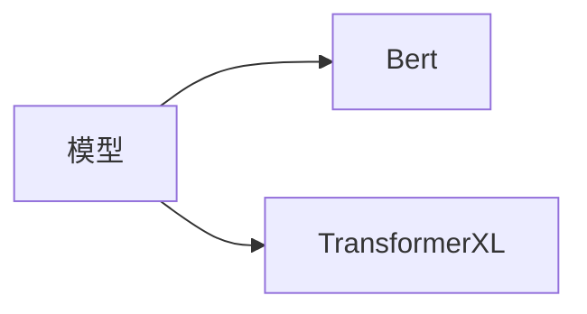

## 整体框架

## 各模块简介

### 爬虫部分

* **数据类型**

* **数据组织形式**

    [数据说明](https://github.com/panzy25/ForeSee/tree/master/Model/Spiders)

### 竞争关系抽取部分

#### 主线1：规则匹配和抽取

* 来源语料：招股说明书中特点章节【公司在行业中的竞争地位】

* 实现思路

    

#### 主线2：Transformer

* 来源语料：股票新闻文本

### 智能检索部分

* **实现流程**

    

* **所用模型**

#### 主线1：Bert接口

* 功能：用于推进和索引端的对接，探讨实时相似度计算的算法
* 流程
    * 通过Bert As Service接口获取内部信息的词向量，提供给索引端
    * 同时为索引端提供词向量相似度计算的脚本

#### 主线2：TransfomerXL

* 预训练模型：TransfomerXL

> [详细实现情况](https://github.com/panzy25/ForeSee/tree/master/Model/Vector)

